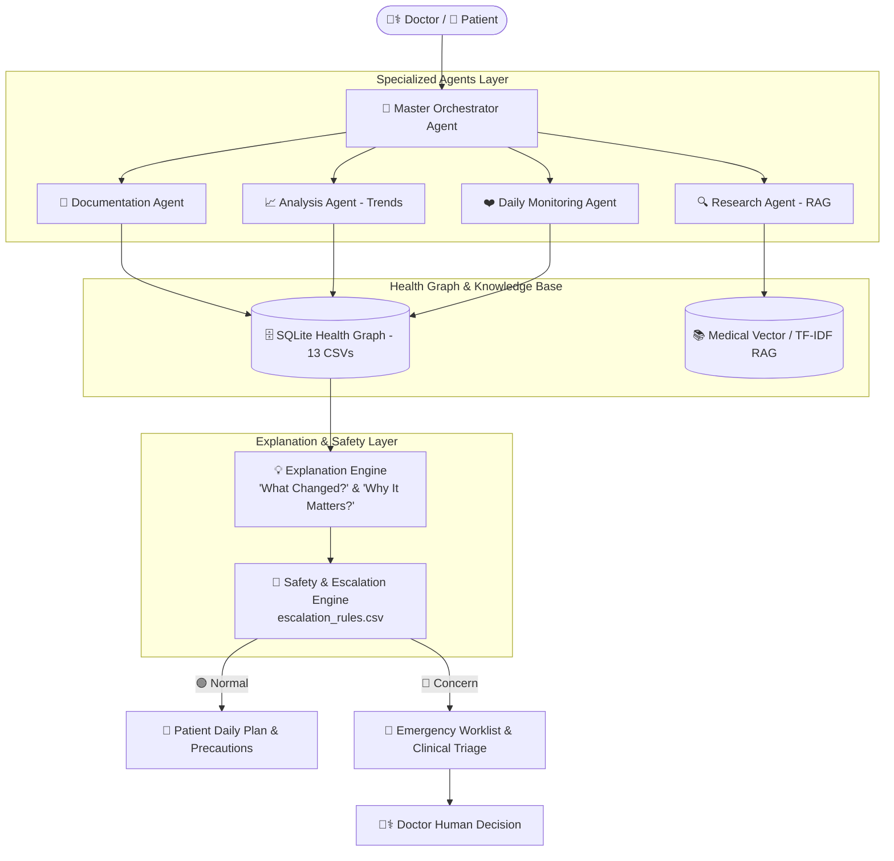

# 🩺 NeuroNex MediSense AI — Healthcare Research & Patient Support Agent

### **Smart India Hackathon 2026 | Problem Statement: AI-Powered Healthcare Research & Patient Support Agent**
**Team Name:** NeuroNex  
**Theme:** MedTech / Healthcare / AI Clinical Decision Support  

---

## 🌟 Executive Overview
In modern healthcare systems, doctors spend up to **50% of their working hours on documentation, record retrieval, and manual data synthesis**, leading to clinician burnout and delayed follow-ups. Meanwhile, patients struggle with **complex medical jargon, low medication adherence, and lack of continuous monitoring between appointments**.

**NeuroNex MediSense AI** is an autonomous, multi-agent clinical platform designed to bridge this gap. It acts as an **AI Healthcare Teammate**:
- 👨⚕️ **For Doctors:** Automates structured SOAP clinical notes, detects longitudinal vitals trends and lab anomalies, synthesizes *"What Changed?"* vs *"Why It Matters?"*, and verifies medical literature with DOI citations.
- 👤 **For Patients:** Provides a 24/7 empathetic health companion, tracks daily medication adherence with interactive dose logging, monitors wellness check-ins, and enforces deterministic emergency escalation rules.

> **USP:** *“AI handles the information. Doctors handle the decisions. More efficient analysis. Better-informed care. More time for patients.”*

---

## 🏗️ Architecture & Multi-Agent Pipeline



---

## 📊 Dataset Schema & Entity Relationship

The platform connects **13 specialized clinical datasets** anchored around `patient_id`:

```
                    patient_id
                         │
          ┌──────────────┼───────────────┐
          │              │               │
          ▼              ▼               ▼
      Patients      Consultations      Vitals
          │              │               │
          │              ▼               ▼
          │         Medications      Lab Results
          │              │
          │              ▼
          │         Adherence
          │
          ├──────────► Symptoms
          │
          ├──────────► Daily Check-ins
          │
          ├──────────► Appointments
          │
          └──────────► Monitoring Events
```

### Dataset Breakdown:
1. `data/patient/patients.csv` — Demographics, baseline diagnoses, allergies, emergency contacts, risk tiers.
2. `data/patient/consultations.csv` — Clinical visit notes, chief complaints, ICD-10 codes, treatment plans.
3. `data/patient/vitals.csv` — 15-day longitudinal time-series (Systolic/Diastolic BP, SpO2, HR, Glucose, Temp).
4. `data/patient/lab_results.csv` — Diagnostic biomarkers (HbA1c, NT-proBNP, Serum Creatinine, Microalbumin).
5. `data/patient/symptoms.csv` — Patient-reported symptoms, severity (1-10), onset timestamps, body locations.
6. `data/patient/daily_checkins.csv` — Daily wellness logs (pain score, sleep duration, fatigue, mood, fluid intake).
7. `data/patient/monitoring_events.csv` — System-detected anomalies (hypertensive spike risk, hypoxemia, missed doses).
8. `data/medication/medications.csv` — Active prescriptions, dosages, administration routes, schedules.
9. `data/medication/medication_adherence.csv` — Doses scheduled vs taken, adherence rate %, compliance trends.
10. `data/appointment/appointments.csv` — Scheduled consultations, departments, visit types.
11. `data/doctor/doctors.csv` & `hospitals.csv` — Physician credentials, hospital trauma centers, emergency contacts.
12. `data/knowledge/` — `medical_research.csv`, `medical_research_chunks.csv`, `disease_knowledge.csv` (RAG knowledge base).
13. `data/safety/escalation_rules.csv` — Deterministic threshold rules for emergency clinical triage.

---

## 🚀 Quickstart Guide

### 1. Installation
```bash
# Clone the repository
git clone https://github.com/yeshvanth087/SIH_2026.git
cd SIH_2026

# Install required dependencies
pip install -r requirements.txt
```

### 2. Run Automated Verification Tests
```bash
python test_healthcare.py
```

### 3. Start the Web Platform
```bash
python run_healthcare.py
```

- **Unified Web Portal**: [http://127.0.0.1:8000](http://127.0.0.1:8000)
- **Interactive Swagger API Docs**: [http://127.0.0.1:8000/docs](http://127.0.0.1:8000/docs)

---

## 🛡️ Core Agent Capabilities

### 👨⚕️ 1. Doctor Command Center
- **Patient 360° Health Graph:** Immediate aggregate view of history, active meds, and risk classifications.
- **The Explanation Engine:** Formulates **"What Changed?"** (vitals deltas, missed doses) and **"Why It Matters?"** (pathophysiological impact).
- **Interactive Vitals Trend Chart:** 15-day longitudinal trajectory with spike and hypoxia detection.
- **Automated SOAP Documentation:** Generates Subjective, Objective, Assessment, Plan notes ready to copy/export.
- **AI Research Verification (RAG):** Queries peer-reviewed journals (AHA/ACC, ADA, GINA, ESC) with DOIs.

### 👤 2. Patient Daily Companion
- **Interactive Medication Adherence:** One-click dose logging with live compliance recalculation.
- **Daily Check-In Logger:** Sliders for pain, sleep, fatigue, mood, and personal symptoms.
- **Proactive Care Precautions:** Condition-specific daily tips (sodium limits, foot checks, inhaler techniques).
- **24/7 AI Companion Chat:** Empathetic guidance guarded by clinical safety thresholds.
- **Emergency SOS Dispatch:** Immediate one-click escalation to assigned hospital and physician.

---

## 🧪 Test Suite Coverage
All 8 automated test suites pass with 100% success:
- `[PASS]` Database table integrity across all 13 CSVs
- `[PASS]` Multi-table Patient 360° joins
- `[PASS]` Research RAG with DOI citations
- `[PASS]` Clinical Analysis Agent vitals trend & spike detection
- `[PASS]` Explanation Engine ("What Changed?" / "Why It Matters?")
- `[PASS]` Deterministic Safety Escalation rules
- `[PASS]` Documentation Agent SOAP generation
- `[PASS]` FastAPI REST API endpoints & chat workflows

---

## 👥 Team NeuroNex
*Smart India Hackathon 2026*
